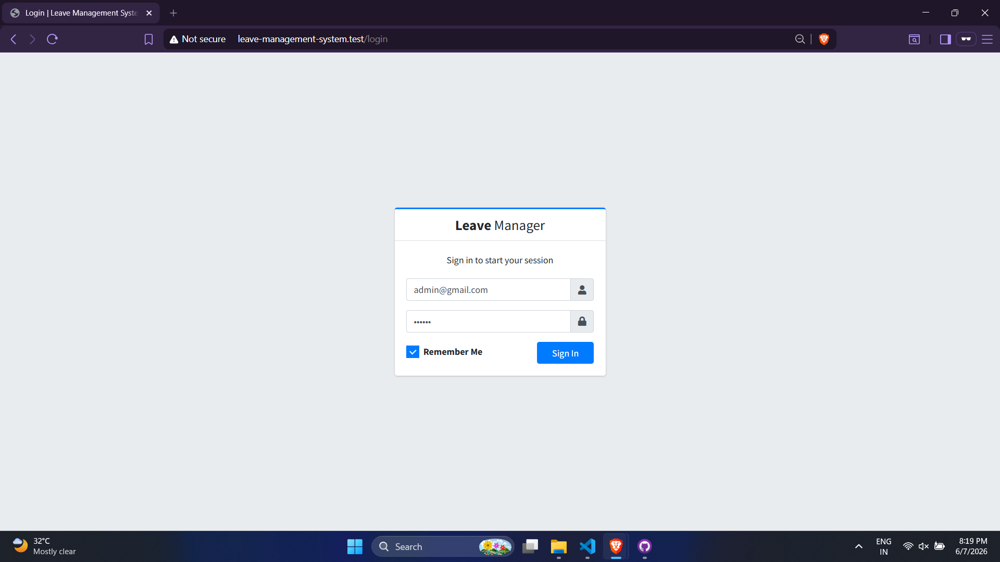
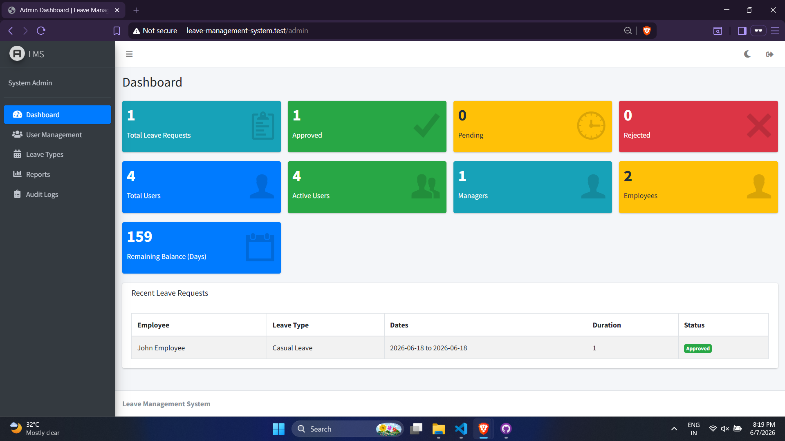
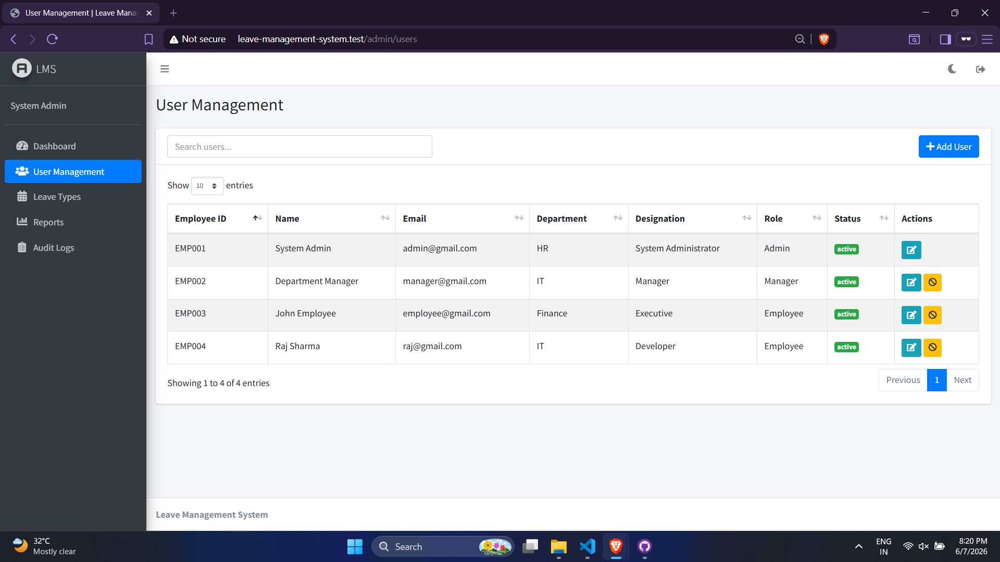
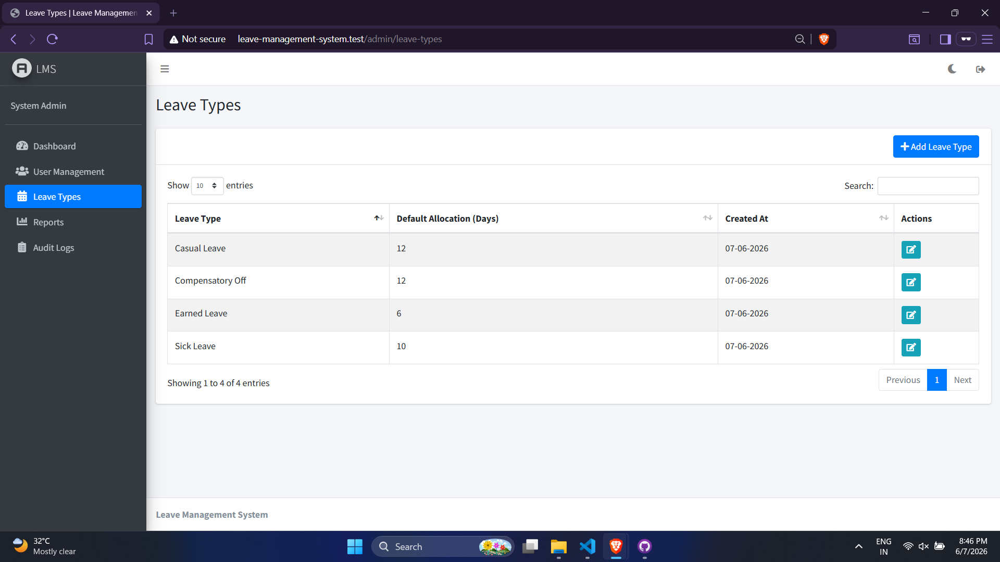
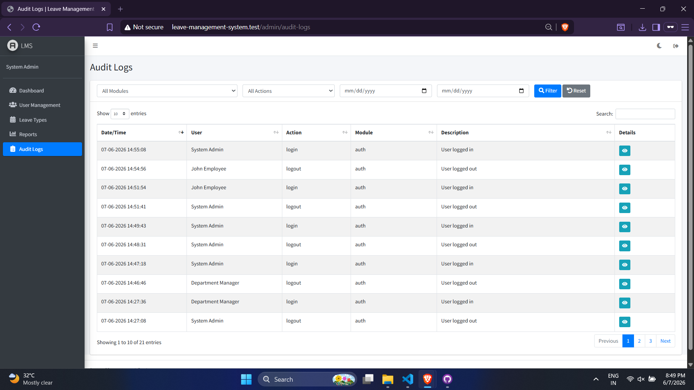
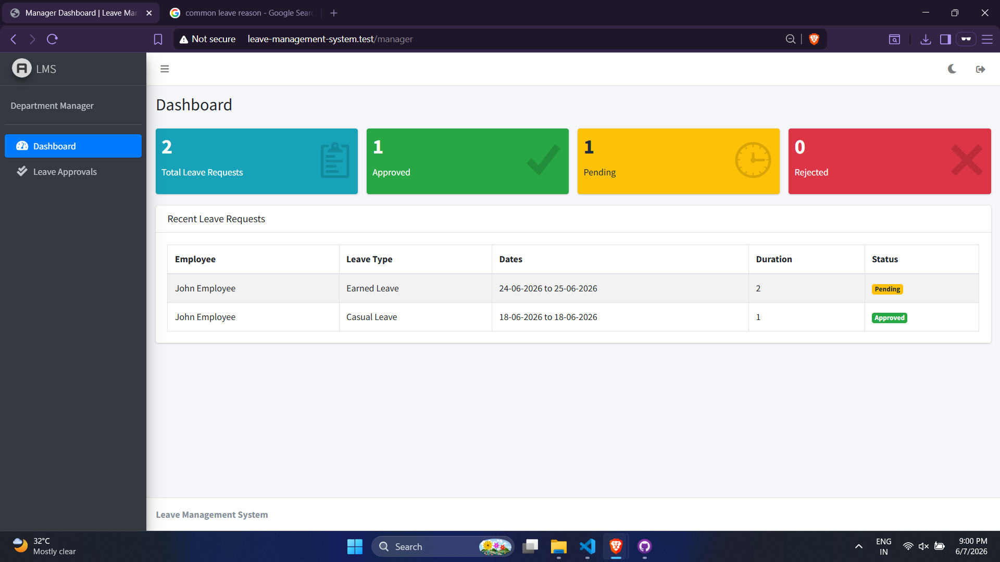
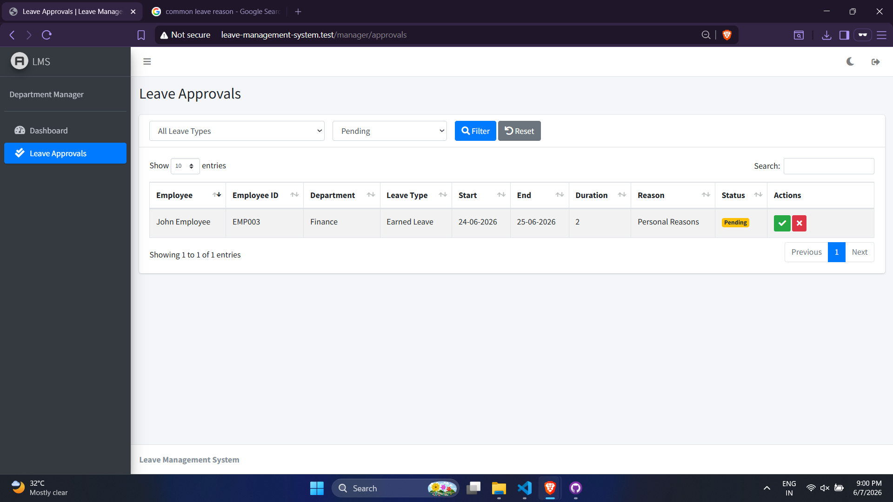
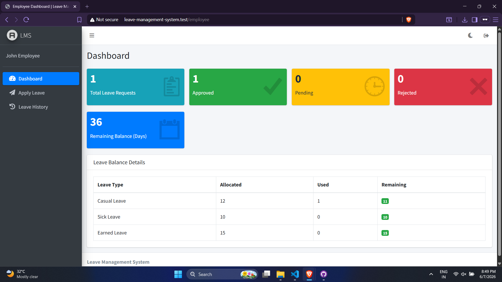
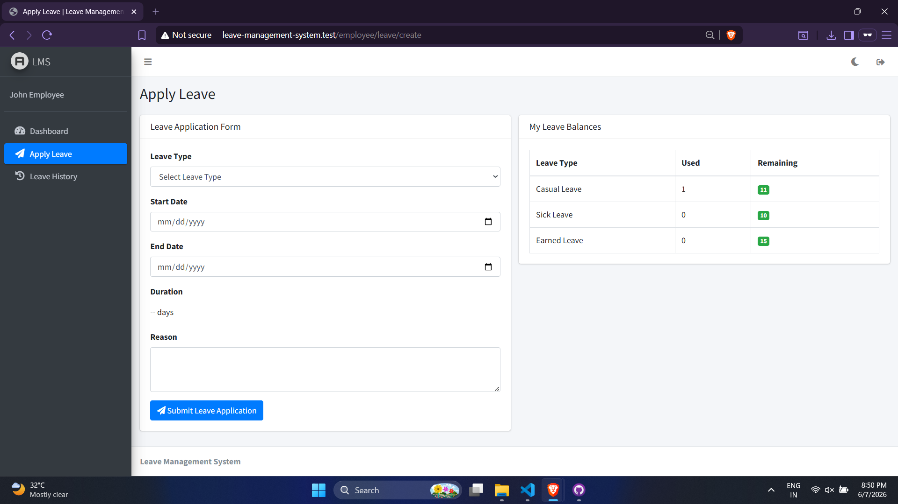
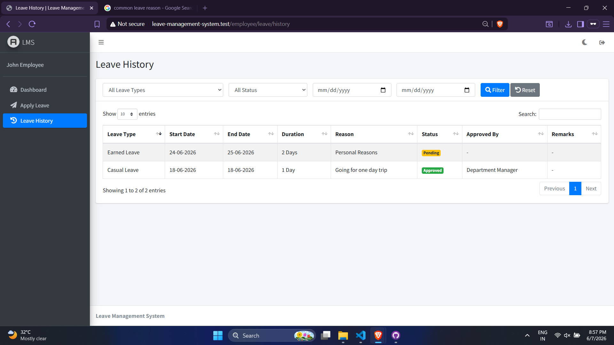

# Employee Leave Management System

A complete **Employee Leave Management System** built with **Laravel 13**, **AdminLTE**, **Bootstrap 5**, **jQuery**, and **AJAX**.

A role-based leave management platform with three distinct dashboards (Admin / Manager / Employee), a custom AJAX authentication module, real-time statistics, and a complete audit trail.

---

## Table of Contents

1. [Features](#features)
2. [Tech Stack](#tech-stack)
3. [Screenshots](#screenshots)
4. [Project Structure](#project-structure)
5. [Database Schema](#database-schema)
6. [Installation](#installation)
7. [Default Login Credentials](#default-login-credentials)
8. [Routes](#routes)
9. [Business Rules](#business-rules)
10. [Architecture Highlights](#architecture-highlights)
11. [UI / UX Features](#ui--ux-features)
12. [Security](#security)

---

## Features

### Role-Based Access
- **Admin** — Full system control: dashboard, user management, leave types, reports, audit logs
- **Manager** — Dashboard with stats, leave approval / rejection workflow
- **Employee** — Dashboard with balance, apply leave, leave history

### Authentication
- Custom authentication module with **AJAX login**
- Login with **email or employee ID** (auto-detected)
- Session management with optional **Remember Me**
- Role-based redirect after login
- Inactive accounts blocked from login

### User Management (Admin)
- Create, edit, search users via AJAX DataTable
- Assign roles (admin / manager / employee)
- Activate / deactivate user accounts
- Initial leave balances created automatically on user creation

### Leave Types (Admin)
- Configure leave types with default allocation
  - Casual Leave: 12
  - Sick Leave: 10
  - Earned Leave: 15
- Add / edit via AJAX modal
- Balance recalculation when allocation is changed

### Leave Application (Employee)
- Apply for leave with auto-calculated duration
- Live leave balance display on the form
- Business rules enforced:
  - Start date >= today
  - End date >= start date
  - Balance validation
  - Overlap prevention

### Leave Approvals (Manager)
- View all leave requests in DataTable (default filter: pending)
- Approve / reject with optional manager remarks
- Balance **deducted automatically** on approval
- Approved / rejected requests cannot be edited

### Leave History (Employee)
- Filterable DataTable by leave type, status, and date range
- Shows approval status, approver, and manager remarks

### Reports (Admin)
- Six summary cards: total, approved, pending, rejected, active users, days approved
- **Leave Type Breakdown** table
- Filterable DataTable by employee, leave type, status, date range

### Audit Logging
Automatically captures:
- Login / Logout
- User creation, update, status change
- Leave application, approval, rejection

Admin viewer features:
- Filter by module, action, and date range
- Detail modal showing full request / response (read-only textareas, blank for null)

### Dashboard
- **Admin** — 9 live stat cards (request breakdown, user counts, remaining balance) + recent requests
- **Manager** — 4 live stat cards + recent requests table
- **Employee** — 5 stat cards (request breakdown, balance) + balance detail table

---

## Tech Stack

| Layer | Technology |
|---|---|
| Backend | PHP 8.x, Laravel 13 |
| Frontend | AdminLTE, Bootstrap 5, jQuery |
| AJAX | jQuery AJAX, DataTables |
| Notifications | Custom toast (top-right) |
| Database | MySQL |
| Architecture | MVC, Service Layer, SOLID, DRY |

---

## Screenshots

### Authentication


### Admin Section
| Dashboard | User Management |
|---|---|
|  |  |

| Leave Types | Leave Reports |
|---|---|
|  |  |

| Audit Logs |
|---|
|  |

### Manager Section
| Dashboard | Leave Approvals |
|---|---|
|  |  |

### Employee Section
| Dashboard | Apply Leave | Leave History |
|---|---|---|
|  |  |  |

---

## Project Structure

```
app/
├── Http/
│   ├── Controllers/
│   │   ├── Admin/
│   │   │   ├── DashboardController.php
│   │   │   ├── UserController.php
│   │   │   ├── LeaveTypeController.php
│   │   │   ├── ReportController.php
│   │   │   └── AuditLogController.php
│   │   ├── Manager/
│   │   │   ├── DashboardController.php
│   │   │   └── ApprovalController.php
│   │   ├── Employee/
│   │   │   ├── DashboardController.php
│   │   │   └── LeaveController.php
│   │   └── Auth/
│   │       └── LoginController.php
│   ├── Middleware/
│   │   └── RoleMiddleware.php
│   └── Requests/
│       ├── Admin/
│       │   ├── StoreUserRequest.php
│       │   ├── UpdateUserRequest.php
│       │   ├── StoreLeaveTypeRequest.php
│       │   └── UpdateLeaveTypeRequest.php
│       ├── Employee/
│       │   └── StoreLeaveRequest.php
│       └── Manager/
│           └── ApprovalRequest.php
├── Models/
│   ├── User.php
│   ├── LeaveType.php
│   ├── LeaveBalance.php
│   ├── LeaveRequest.php
│   └── AuditLog.php
└── Services/
    ├── UserService.php
    ├── LeaveService.php
    └── AuditService.php

resources/views/
├── admin/
│   ├── layout.blade.php
│   ├── dashboard.blade.php
│   ├── users/index.blade.php
│   ├── leave_types/index.blade.php
│   ├── reports/index.blade.php
│   └── audit_logs/index.blade.php
├── manager/
│   ├── layout.blade.php
│   ├── dashboard.blade.php
│   └── approvals/index.blade.php
├── employee/
│   ├── layout.blade.php
│   ├── dashboard.blade.php
│   └── leave/
│       ├── create.blade.php
│       └── history.blade.php
├── auth/
│   └── login.blade.php
└── index.blade.php

public/assets/js/
├── common.js
├── login.js
├── admin/
│   ├── users.js
│   ├── leave-types.js
│   ├── dashboard.js
│   ├── reports.js
│   └── audit-logs.js
├── manager/
│   ├── dashboard.js
│   └── approvals.js
└── employee/
    ├── dashboard.js
    ├── leave.js
    └── leave-history.js

```

---

## Database Schema

### Users (extended)
| Field | Type |
|---|---|
| employee_id | string (unique) |
| name | string |
| email | string (unique) |
| mobile | string (nullable) |
| department | string (HR / IT / Finance) |
| designation | string |
| role | enum (admin / manager / employee) |
| status | enum (active / inactive) |
| password | hashed |

### Leave Types
| Field | Type |
|---|---|
| name | string (unique) |
| default_allocation | small integer |

### Leave Balances
| Field | Type |
|---|---|
| user_id | foreign key |
| leave_type_id | foreign key |
| year | small integer |
| allocated_days | small integer |
| used_days | small integer (default 0) |

### Leave Requests
| Field | Type |
|---|---|
| user_id | foreign key |
| leave_type_id | foreign key |
| start_date | date |
| end_date | date |
| duration | small integer |
| reason | text (nullable) |
| status | enum (pending / approved / rejected) |
| approved_by | foreign key (nullable) |
| approved_at | timestamp (nullable) |
| manager_remarks | text (nullable) |

### Audit Logs
| Field | Type |
|---|---|
| user_id | foreign key (nullable) |
| action | string |
| request | text (nullable) |
| response | text (nullable) |
| module | string |
| description | text (nullable) |
| created_at | timestamp |

---

## Installation

### Requirements
- PHP 8.x
- Composer
- MySQL
- Node.js & npm (optional — for Vite asset compilation)

### Setup Steps

```bash
# 1. Clone the repository
git clone <repository-url>
cd leave-management-system

# 2. Install PHP dependencies
composer install

# 3. Install JS dependencies (optional)
npm install

# 4. Copy environment file
cp .env.example .env

# 5. Configure database in .env
DB_CONNECTION=mysql
DB_HOST=127.0.0.1
DB_PORT=3306
DB_DATABASE=leave-management-system
DB_USERNAME=root
DB_PASSWORD=

# 6. Generate application key
php artisan key:generate

# 7. Run migrations
php artisan migrate

# 8. Seed the database
php artisan db:seed

# 9. (Optional) Build front-end assets
npm run build

# 10. Start the development server
php artisan serve
```

---

## Default Login Credentials

| Role | Email | Employee ID | Password |
|---|---|---|---|
| Admin | admin@gmail.com | EMP001 | 123456 |
| Manager | manager@gmail.com | EMP002 | 123456 |
| Employee | employee@gmail.com | EMP003 | 123456 |

> You can log in with **either email or employee ID**.

---

## Routes

### Admin (`/admin/*`)
| Method | URI | Description |
|---|---|---|
| GET | `/admin` | Dashboard |
| GET | `/admin/dashboard/stats` | AJAX stats |
| GET | `/admin/users` | User management |
| GET | `/admin/users/list` | AJAX user list |
| POST | `/admin/users` | Create user |
| GET | `/admin/users/{id}` | Show user |
| PUT | `/admin/users/{id}` | Update user |
| PATCH | `/admin/users/{id}/status` | Toggle status |
| GET | `/admin/leave-types` | Leave types |
| GET | `/admin/leave-types/list` | AJAX leave types |
| POST | `/admin/leave-types` | Create leave type |
| GET | `/admin/leave-types/{id}` | Show leave type |
| PUT | `/admin/leave-types/{id}` | Update leave type |
| GET | `/admin/reports` | Reports |
| GET | `/admin/reports/list` | AJAX report data |
| GET | `/admin/reports/summary` | AJAX summary stats |
| GET | `/admin/audit-logs` | Audit logs |
| GET | `/admin/audit-logs/list` | AJAX audit list |
| GET | `/admin/audit-logs/{id}` | Show audit detail |

### Manager (`/manager/*`)
| Method | URI | Description |
|---|---|---|
| GET | `/manager` | Dashboard |
| GET | `/manager/dashboard/stats` | AJAX stats |
| GET | `/manager/approvals` | Leave approvals |
| GET | `/manager/approvals/list` | AJAX approval list |
| PUT | `/manager/approvals/{id}/approve` | Approve leave |
| PUT | `/manager/approvals/{id}/reject` | Reject leave |

### Employee (`/employee/*`)
| Method | URI | Description |
|---|---|---|
| GET | `/employee` | Dashboard |
| GET | `/employee/dashboard/stats` | AJAX stats |
| GET | `/employee/leave/create` | Apply leave form |
| POST | `/employee/leave` | Submit leave |
| GET | `/employee/leave/history` | Leave history |
| GET | `/employee/leave/list` | AJAX leave history |

### Auth
| Method | URI | Description |
|---|---|---|
| GET | `/login` | Login form |
| POST | `/login` | AJAX login (email or employee ID) |
| POST | `/logout` | AJAX logout |

---

## Business Rules

1. **Start Date** must be today or later
2. **End Date** must be on or after start date
3. **Duration** is auto-calculated (end - start + 1 days)
4. **Leave Balance** is validated before submission
5. **Overlapping** leave requests are prevented (rejected status is excluded)
6. **Approved / rejected** requests cannot be edited
7. **Balance is deducted** only on approval, not on rejection
8. **All critical operations** use `DB::transaction()` for data integrity
9. **Audit logs** capture login, logout, user CRUD, status changes, leave application, approval, rejection — including raw request / response payloads
10. **Login with email OR employee ID** is supported (auto-detected by format)

---

## Architecture Highlights

### Service Layer
All business logic lives in `app/Services/`:
- `UserService` — user CRUD + balance initialization
- `LeaveService` — duration calculation, balance / overlap validation, approval / rejection
- `AuditService` — central audit logging with helper methods per action type

### Form Request Validation
All request data is validated through dedicated FormRequest classes in `app/Http/Requests/`:
- `StoreUserRequest`, `UpdateUserRequest`
- `StoreLeaveTypeRequest`, `UpdateLeaveTypeRequest`
- `StoreLeaveRequest`
- `ApprovalRequest`

### Middleware
- `RoleMiddleware` — protects `/admin/*`, `/manager/*`, `/employee/*` and returns JSON 403 for AJAX requests

### Transactions
Critical operations wrapped in `DB::transaction()`:
- Leave application
- Leave approval + balance deduction
- Leave rejection
- User creation + initial balance setup

---

## UI / UX Features

- **Dark / Light mode toggle** in the navbar — preference saved to `localStorage`
- **Custom toast notifications** in the top-right corner (success / error / warning / info) — auto-dismiss after 2s, click to close
- **Logout as icon button** with toast confirmation
- **DataTables** — search, pagination, length menu, AJAX reload on filter change
- **Sidebar collapses** smoothly with content reflow
- **Login page** — single field accepts email or employee ID, button height fixed
- **Reports layout** — DataTable on left, Leave Type Breakdown on right
- **Status badges** color-coded (pending = yellow, approved = green, rejected = red)

---

## Security

- Passwords hashed with `Hash::make()` (bcrypt)
- CSRF protection on all forms via `csrf_token()` and meta tag
- AJAX requests send `X-CSRF-TOKEN` header automatically (configured in `common.js`)
- Role-based route protection via `RoleMiddleware`
- Users cannot deactivate their own account
- Users cannot change their own role
- Inactive users are blocked from logging in

---

## License

MIT
</content>
</invoke>